# Zenoh-MQTT Bridge Project

This project is a comprehensive bridge system designed to connect **Zenoh** and **MQTT** protocols. The project enables seamless data transfer between Zenoh and MQTT protocols from IoT devices.

## 🎯 Project Objectives

This project is a **protocol bridge** system that enables different protocols to work together in modern IoT ecosystems. Its main objectives are:

1. **Protocol Translation**: Data transfer between MQTT and Zenoh protocols
2. **Real-Time Communication**: Instant processing of sensor data
3. **Scalable Architecture**: Docker-based microservices structure
4. **Monitoring and Control**: Visual flow control with Node-RED
5. **Testing Environment**: Testable system with Pub/Sub mechanisms

## 🏗️ System Architecture

### Core Components

#### 1. **Zenoh Router** (`zenoh-router`)
- **Port**: 7447 (TCP), 8000 (REST HTTP)
- **Role**: Central router for Zenoh network
- **Features**: 
  - Message routing over Zenoh protocol
  - REST API support
  - Debug logging

#### 2. **MQTT Broker** (`mosquitto`)
- **Port**: 1883 (MQTT), 9001 (WebSocket)
- **Role**: Message broker for MQTT protocol
- **Features**:
  - Eclipse Mosquitto based
  - Configuration and log management
  - ACL (Access Control List) support

#### 3. **Zenoh-MQTT Bridge** (`zenoh-mqtt-bridge`)
- **Port**: 8001 (HTTP REST)
- **Role**: Main bridge service - protocol translation between MQTT and Zenoh
- **Features**:
  - Bidirectional message transfer
  - Flexibility with configuration files
  - Sensor data filtering

#### 4. **Node-RED** (`node-red`)
- **Port**: 1880 (Web UI)
- **Role**: Visual flow editor and automation
- **Features**:
  - Web-based interface
  - MQTT and Zenoh integration
  - Flow-based programming

#### 5. **Test Components**
- **MQTT Publisher**: Automatic sensor data generator
- **MQTT Subscriber**: Client listening to MQTT messages
- **Zenoh Subscriber**: Python application listening to Zenoh messages

## 📊 UML Diagrams

### System Component Diagram

```mermaid
graph TB
    subgraph "Docker Environment"
        MQTTPub[MQTT Publisher<br/>Sensor Data Generator]
        MQTTSub[MQTT Subscriber<br/>MQTT Listener]
        
        subgraph "Core Services"
            Mosquitto[🦟 Mosquitto MQTT Broker<br/>Port: 1883, 9001]
            ZenohRouter[🌐 Zenoh Router<br/>Port: 7447, 8000]
            Bridge[🌉 Zenoh-MQTT Bridge<br/>Port: 8001]
        end
        
        subgraph "Management & Monitoring"
            NodeRED[🔴 Node-RED<br/>Port: 1880<br/>Visual Flow Editor]
        end
        
        subgraph "Zenoh Ecosystem"
            ZenohSub[🐍 Zenoh Subscriber<br/>Python Application]
        end
        
        subgraph "External Testing"
            PubPy[📤 pub.py<br/>Zenoh Publisher]
            SubPy[📥 sub.py<br/>Zenoh Subscriber]
        end
    end
    
    %% Data Flow Connections
    MQTTPub -->|MQTT Publish| Bridge
    Bridge -->|MQTT Subscribe| Mosquitto
    Bridge <-->|Zenoh Protocol| ZenohRouter
    ZenohRouter <-->|Zenoh Subscribe| ZenohSub
    
    Mosquitto <-->|MQTT| MQTTSub
    NodeRED <-->|MQTT| Mosquitto
    NodeRED <-->|Zenoh-MQTT| Bridge
    
    PubPy <-->|Zenoh Protocol| ZenohRouter
    SubPy <-->|Zenoh Protocol| ZenohRouter
    
    %% Styling
    classDef mqttService fill:#e1f5fe
    classDef zenohService fill:#f3e5f5
    classDef bridgeService fill:#fff3e0
    classDef managementService fill:#e8f5e8
    
    class Mosquitto,MQTTPub,MQTTSub mqttService
    class ZenohRouter,ZenohSub,PubPy,SubPy zenohService
    class Bridge bridgeService
    class NodeRED managementService
```



### Data Flow Diagram

```mermaid
sequenceDiagram
    participant Sensor as 📡 MQTT Publisher<br/>(Sensor Simulator)
    participant Bridge as 🌉 Zenoh-MQTT Bridge
    participant MQTT as 🦟 Mosquitto Broker
    participant ZRouter as 🌐 Zenoh Router
    participant ZSub as 🐍 Zenoh Subscriber
    participant MSub as 📱 MQTT Subscriber
    participant NodeRED as 🔴 Node-RED
    
    Note over Sensor,NodeRED: Sensor Data Generation and Distribution
    
    %% Data transmission from MQTT Publisher to Bridge
    Sensor->>Bridge: MQTT Publish<br/>topic: sensor/temperature<br/>payload: {"temp":25,"humidity":60}
    
    %% Translation from Bridge to Zenoh
    Bridge->>ZRouter: Zenoh Put<br/>key: mqtt/demo/sensor/temperature<br/>value: {"temp":25,"humidity":60}
    
    %% Data delivery to Zenoh Subscriber
    ZRouter->>ZSub: Zenoh Sample<br/>Subscription Match
    
    %% Transfer from Bridge to MQTT Broker as well
    Bridge->>MQTT: MQTT Publish<br/>topic: sensor/temperature
    
    %% Data delivery to MQTT Subscriber
    MQTT->>MSub: MQTT Message<br/>topic: sensor/temperature
    
    %% Monitoring with Node-RED
    MQTT->>NodeRED: MQTT Subscribe<br/>Real-time Monitoring
    
    Note over Sensor,NodeRED: Bidirectional Protocol Bridge Active
```



### Network Architecture Diagram


## 🔧 Configuration Details

### Zenoh-MQTT Bridge Configuration

The bridge service is configured with the `zenoh-mqtt-bridge/config.json5` file:

- **Mode**: Client mode (connects to Zenoh router)
- **MQTT Port**: 1883 (standard MQTT port)
- **Scope**: `mqtt/demo` (MQTT messages are published in Zenoh with this prefix)
- **Topic Filters**: 
  - Allow: Accept all messages (`.*`)
  - Deny: Reject system messages (`^\\$SYS/.*`)

### Data Flow Schema

1. **MQTT Publisher** → generates sensor data (`sensor/temperature`)
2. **Zenoh-MQTT Bridge** → receives MQTT message and converts to Zenoh format
3. **Zenoh Router** → distributes message with `mqtt/demo/sensor/temperature` key
4. **Zenoh Subscriber** → Python application captures messages
5. **MQTT Subscriber** → traditional MQTT client receives messages
6. **Node-RED** → monitors entire flow through web interface

## 🚀 Use Cases

### 1. IoT Sensor Data Collection
- Temperature, humidity sensors
- Real-time data streaming
- Multi-protocol support

### 2. Hybrid Protocol Systems
- Existing MQTT infrastructure
- Modern Zenoh protocol integration
- Backward compatibility

### 3. Testing and Development Environment
- Protocol bridging tests
- Performance measurements
- Development sandbox

## 📁 Project Structure

```
📦 zenoh-mqtt-bridge/
├── 🐳 docker-compose.yaml      # Main orchestration file
├── 📄 README.md               # This file
├── 🐍 pub.py                 # Zenoh publisher test script
├── 🐍 sub.py                 # Zenoh subscriber test script
├── 📁 mosquitto/             # MQTT broker configuration
│   ├── config/
│   │   ├── acl.conf          # Access Control List
│   │   └── mosquitto.conf    # Broker configuration
│   ├── data/                 # Persistent data
│   └── log/                  # Log files
├── 📁 nodered/               # Node-RED configuration
│   ├── 🐳 Dockerfile
│   ├── 📦 package.json
│   └── data/
├── 📁 zenoh/                 # Zenoh configurations
└── 📁 zenoh-mqtt-bridge/     # Bridge configuration
    └── config.json5          # Main bridge config
```

## 🎮 Quick Start

```bash
# Start all services
docker-compose up -d

# Follow logs
docker-compose logs -f

# Run test scripts
python3 pub.py  # Terminal 1
python3 sub.py  # Terminal 2

# Web interfaces
# Node-RED: http://localhost:1880
# Zenoh REST API: http://localhost:8000
```

This project is a comprehensive solution designed for developers who want to manage protocol diversity in modern IoT systems and use the advantages of different protocols together.