# Zenoh Multi-Protocol Bridge Project

This project is a comprehensive multi-protocol bridge system designed to connect **Zenoh**, **MQTT**, and **ROS2** protocols. The project enables seamless data transfer between different communication protocols commonly used in IoT, robotics, and distributed systems.

## 🎯 Project Objectives

This project is a **multi-protocol bridge** system that enables different protocols to work together in modern IoT and robotics ecosystems. Its main objectives are:

1. **Multi-Protocol Translation**: Data transfer between MQTT, Zenoh, and ROS2 protocols
2. **Real-Time Communication**: Instant processing of sensor and robotics data
3. **Scalable Architecture**: Docker-based microservices structure
4. **Monitoring and Control**: Visual flow control with Node-RED
5. **Robotics Integration**: ROS2 DDS bridge for robotics applications
6. **Testing Environment**: Comprehensive testable system with multiple protocol support

## 🏗️ System Architecture

### Core Components

#### 1. **Zenoh Router** (`zenoh-router`)
- **Port**: 7447 (TCP), 8000 (REST HTTP)
- **Role**: Central router for Zenoh network
- **Features**: 
  - Message routing over Zenoh protocol
  - REST API support
  - Debug logging

#### 2. **MQTT Broker** (`mosquitto`)
- **Port**: 1883 (MQTT), 9001 (WebSocket)
- **Role**: Message broker for MQTT protocol
- **Features**:
  - Eclipse Mosquitto based
  - Configuration and log management
  - ACL (Access Control List) support

#### 3. **Zenoh-MQTT Bridge** (`zenoh-mqtt-bridge`)
- **Port**: 8001 (HTTP REST), 1884 (MQTT)
- **Role**: Protocol bridge between MQTT and Zenoh
- **Features**:
  - Bidirectional message transfer
  - Configuration-driven topic mapping
  - Real-time data streaming

#### 4. **ROS2 Humble** (`ros2-humble`)
- **Port**: 8765 (Foxglove Bridge)
- **Role**: ROS2 robotics framework with DDS communication
- **Features**:
  - ROS2 Humble distribution
  - Foxglove Bridge for web visualization
  - CycloneDDS middleware
  - ROS domain configuration

#### 5. **Zenoh-ROS2DDS Bridge** (`zenoh-ros2dds-bridge`)
- **Port**: 8002 (HTTP REST), 7449 (Zenoh)
- **Role**: Protocol bridge between ROS2 DDS and Zenoh
- **Features**:
  - ROS2 topic/service/action bridging
  - Namespace isolation (/bot1)
  - Selective topic filtering
  - Timestamping support

#### 6. **Node-RED** (`node-red`)
- **Port**: 1880 (Web UI)
- **Role**: Visual flow editor and automation platform
- **Features**:
  - Web-based interface
  - MQTT, Zenoh, and ROS integration
  - Real-time dashboard creation
  - Flow-based programming

#### 7. **Test Components**
- **MQTT Publisher**: Automatic sensor data generator
- **MQTT Subscriber**: Client listening to MQTT messages  
- **Zenoh Subscriber**: Python application for Zenoh data
- **External Test Scripts**: pub.py and sub.py for development testing

## 📊 UML Diagrams

### System Component Diagram

```mermaid
graph TB
    subgraph "Docker Environment"
        MQTTPub[MQTT Publisher<br/>Sensor Data Generator]
        MQTTSub[MQTT Subscriber<br/>MQTT Listener]
        
        subgraph "Core Services"
            Mosquitto[🦟 Mosquitto MQTT Broker<br/>Port: 1883, 9001]
            ZenohRouter[🌐 Zenoh Router<br/>Port: 7447, 8000]
            MQTTBridge[🌉 Zenoh-MQTT Bridge<br/>Port: 8001, 1884]
        end
        
        subgraph "ROS2 Ecosystem"
            ROS2[🤖 ROS2 Humble<br/>Port: 8765<br/>Foxglove Bridge]
            ROSBridge[🔗 Zenoh-ROS2DDS Bridge<br/>Port: 8002, 7449<br/>Namespace: /bot1]
        end
        
        subgraph "Management & Monitoring"
            NodeRED[🔴 Node-RED<br/>Port: 1880<br/>Visual Flow Editor]
        end
        
        subgraph "Zenoh Ecosystem"
            ZenohSub[🐍 Zenoh Subscriber<br/>Python Application]
        end
        
        subgraph "External Testing"
            PubPy[📤 pub.py<br/>Zenoh Publisher]
            SubPy[📥 sub.py<br/>Zenoh Subscriber]
        end
    end
    
    %% Data Flow Connections
    MQTTPub -->|MQTT Publish| MQTTBridge
    MQTTBridge -->|MQTT Subscribe| Mosquitto
    MQTTBridge <-->|Zenoh Protocol| ZenohRouter
    ZenohRouter <-->|Zenoh Subscribe| ZenohSub
    
    %% ROS2 Integration
    ROS2 <-->|DDS Communication| ROSBridge
    ROSBridge <-->|Zenoh Protocol| ZenohRouter
    
    %% Traditional MQTT Flow
    Mosquitto <-->|MQTT| MQTTSub
    NodeRED <-->|MQTT| Mosquitto
    NodeRED <-->|Zenoh-MQTT| MQTTBridge
    NodeRED <-->|ROS Bridge| ROS2
    
    %% External Testing
    PubPy <-->|Zenoh Protocol| ZenohRouter
    SubPy <-->|Zenoh Protocol| ZenohRouter
    
    %% Styling
    classDef mqttService fill:#e1f5fe
    classDef zenohService fill:#f3e5f5
    classDef bridgeService fill:#fff3e0
    classDef rosService fill:#e8f5e8
    classDef managementService fill:#fce4ec
    
    class Mosquitto,MQTTPub,MQTTSub mqttService
    class ZenohRouter,ZenohSub,PubPy,SubPy zenohService
    class MQTTBridge,ROSBridge bridgeService
    class ROS2 rosService
    class NodeRED managementService
```



### Multi-Protocol Data Flow Diagram

```mermaid
sequenceDiagram
    participant Sensor as 📡 MQTT Publisher<br/>(Sensor Simulator)
    participant MQTTBridge as 🌉 Zenoh-MQTT Bridge
    participant MQTT as 🦟 Mosquitto Broker
    participant ZRouter as 🌐 Zenoh Router
    participant ROSBridge as � Zenoh-ROS2DDS Bridge
    participant ROS2 as 🤖 ROS2 Humble
    participant ZSub as � Zenoh Subscriber
    participant NodeRED as 🔴 Node-RED
    
    Note over Sensor,NodeRED: Multi-Protocol Data Distribution
    
    %% MQTT to Zenoh Flow
    Sensor->>MQTTBridge: MQTT Publish<br/>topic: sensor/temperature<br/>payload: {"temp":25,"humidity":60}
    
    MQTTBridge->>ZRouter: Zenoh Put<br/>key: mqtt/demo/sensor/temperature<br/>value: {"temp":25,"humidity":60}
    
    %% Zenoh to ROS2 Flow  
    ZRouter->>ROSBridge: Zenoh Sample<br/>key: mqtt/demo/sensor/temperature
    ROSBridge->>ROS2: ROS2 Topic<br/>/bot1/sensor_data<br/>DDS Message
    
    %% Zenoh Subscriber
    ZRouter->>ZSub: Zenoh Sample<br/>Subscription Match
    
    %% Traditional MQTT Flow
    MQTTBridge->>MQTT: MQTT Publish<br/>topic: sensor/temperature
    MQTT->>NodeRED: MQTT Subscribe<br/>Real-time Monitoring
    
    %% ROS2 to Zenoh (Bidirectional)
    ROS2->>ROSBridge: ROS2 Publish<br/>/bot1/cmd_vel
    ROSBridge->>ZRouter: Zenoh Put<br/>key: ros2/bot1/cmd_vel
    ZRouter->>ZSub: Zenoh Sample<br/>Robot Commands
    
    Note over Sensor,NodeRED: Triple Protocol Bridge Active<br/>MQTT ↔ Zenoh ↔ ROS2
```



### Network Architecture Diagram


## 🔧 Configuration Details

### Zenoh-MQTT Bridge Configuration

The MQTT bridge service is configured with the `zenoh-mqtt-bridge/config.json5` file:

- **Mode**: Client mode (connects to Zenoh router)
- **MQTT Port**: 1883 (standard MQTT port) - mapped to host port 1884
- **Scope**: `mqtt/demo` (MQTT messages are published in Zenoh with this prefix)
- **Topic Filters**: 
  - Allow: Accept all messages (`.*`)
  - Deny: Reject system messages (`^\\$SYS/.*`)

### Zenoh-ROS2DDS Bridge Configuration

The ROS2 bridge service is configured with the `zenoh-ros2dds-bridge/config.json5` file:

- **Mode**: Client mode (connects to Zenoh router)
- **Namespace**: `/bot1` (ROS2 topics are prefixed with this namespace)
- **ROS Domain**: 0 (ROS_DOMAIN_ID for DDS communication)
- **Middleware**: CycloneDDS (high-performance DDS implementation)
- **Topic Filtering**: Denies internal ROS2 topics (rosout, parameters, _internal)
- **Features**: Timestamping enabled, REST API on port 8000

### ROS2 Humble Configuration

- **Distribution**: ROS2 Humble (LTS version)
- **DDS Middleware**: CycloneDDS with custom XML configuration
- **Foxglove Bridge**: Web-based visualization on port 8765
- **Network Configuration**: Localhost-only for security

### Data Flow Schema

1. **MQTT Publisher** → generates sensor data (`sensor/temperature`)
2. **Zenoh-MQTT Bridge** → receives MQTT message and converts to Zenoh format (`mqtt/demo/sensor/temperature`)
3. **Zenoh Router** → distributes message across the network
4. **Zenoh-ROS2DDS Bridge** → converts Zenoh messages to ROS2 topics (`/bot1/...`)
5. **ROS2 System** → processes robotics data and publishes commands
6. **Multiple Subscribers** → Python applications, MQTT clients, and ROS2 nodes receive data
7. **Node-RED** → monitors and visualizes entire multi-protocol flow

## 🚀 Use Cases

### 1. IoT-Robotics Integration
- Sensor data from IoT devices (MQTT) → Robot control systems (ROS2)
- Real-time environmental data for autonomous robots
- Multi-protocol communication in smart factories

### 2. Hybrid Communication Systems
- Legacy MQTT infrastructure integration
- Modern Zenoh protocol adoption
- ROS2 robotics ecosystem connectivity
- Protocol agnostic application development

### 3. Research and Development Platform
- Multi-protocol testing environment
- Performance comparison between protocols
- Development sandbox for distributed systems
- Educational platform for protocol bridging

### 4. Industrial Automation
- SCADA systems (MQTT) ↔ Robot controllers (ROS2)
- Edge computing with protocol translation
- Real-time monitoring and control dashboards

### 5. Smart City Applications
- IoT sensors ↔ Autonomous vehicles communication
- Traffic management systems
- Environmental monitoring with robotic response

## 📁 Project Structure

```
📦 zenoh-multi-protocol-bridge/
├── 🐳 docker-compose.yaml           # Main orchestration file
├── 📄 README.md                    # This documentation
├── 🐍 pub.py                      # Zenoh publisher test script
├── 🐍 sub.py                      # Zenoh subscriber test script
├── 📄 fuxa.txt                    # Optional FUXA SCADA configuration
├── 📁 mosquitto/                   # MQTT broker configuration
│   ├── config/
│   │   ├── acl.conf               # Access Control List
│   │   └── mosquitto.conf         # Broker configuration
│   ├── data/                      # Persistent MQTT data
│   └── log/                       # MQTT broker logs
├── 📁 nodered/                     # Node-RED configuration
│   ├── 🐳 Dockerfile
│   ├── 📦 package.json
│   └── data/
│       ├── flows.json             # Node-RED flows
│       └── settings.js            # Node-RED settings
├── 📁 ros2-humble/                 # ROS2 Humble container
│   ├── 🐳 Dockerfile              # ROS2 setup with Foxglove
│   └── cyclonedds.xml             # DDS configuration
├── 📁 zenoh/                       # Legacy Zenoh configurations
│   └── bridge-config.json5
├── 📁 zenoh-mqtt-bridge/           # MQTT Bridge configuration
│   ├── config.json5               # Main MQTT bridge config
│   └── config.yaml                # Alternative config format
├── 📁 zenoh-ros2dds-bridge/        # ROS2 Bridge configuration
│   ├── 🐳 Dockerfile              # Custom ROS2 bridge container
│   └── config.json5               # ROS2 bridge configuration
└── 📁 zenoh-subscriber/            # Python Zenoh subscriber
    ├── 🐳 Dockerfile
    └── subscriber.py               # Zenoh listener application
```

## 🎮 Quick Start

```bash
# Start all services
docker-compose up -d

# Follow logs for all services
docker-compose logs -f

# Check specific service logs
docker-compose logs -f zenoh-router
docker-compose logs -f zenoh-mqtt-bridge
docker-compose logs -f zenoh-ros2dds-bridge

# Run external test scripts
python3 pub.py  # Terminal 1 - Zenoh publisher
python3 sub.py  # Terminal 2 - Zenoh subscriber

# Web interfaces and APIs
# Node-RED Dashboard: http://localhost:1880
# Zenoh REST API: http://localhost:8000
# MQTT Bridge API: http://localhost:8001  
# ROS2 Bridge API: http://localhost:8002
# Foxglove Studio: http://localhost:8765
```

## 🌐 Available Endpoints

| Service | Port | Protocol | Description |
|---------|------|----------|-------------|
| Mosquitto MQTT | 1883 | MQTT | Standard MQTT broker |
| Mosquitto WebSocket | 9001 | WebSocket | MQTT over WebSocket |
| Zenoh Router | 7447 | Zenoh | Main Zenoh routing |
| Zenoh REST API | 8000 | HTTP | Zenoh REST interface |
| MQTT Bridge | 1884 | MQTT | Bridge MQTT interface |
| MQTT Bridge API | 8001 | HTTP | Bridge configuration API |
| ROS2 Bridge | 7449 | Zenoh | ROS2-Zenoh bridge port |
| ROS2 Bridge API | 8002 | HTTP | ROS2 bridge REST API |
| Foxglove Bridge | 8765 | WebSocket | ROS2 web visualization |
| Node-RED | 1880 | HTTP | Flow editor and dashboard |

## 🔍 Testing Multi-Protocol Communication

### MQTT → Zenoh → ROS2 Flow Test

```bash
# Terminal 1: Subscribe to all Zenoh traffic
python3 sub.py

# Terminal 2: Publish MQTT message (auto-bridge to Zenoh)
mosquitto_pub -h localhost -p 1884 -t "robot/cmd" -m '{"linear":1.0,"angular":0.5}'

# Terminal 3: Monitor ROS2 topics (if ROS2 tools installed locally)
# This will show bridged data in ROS2 namespace /bot1/
```

### Cross-Protocol Monitoring

```bash
# Monitor MQTT traffic
mosquitto_sub -h localhost -p 1883 -t "sensor/#" -v

# Monitor specific Zenoh keys
# Use the web interfaces for real-time monitoring:
# - Node-RED: http://localhost:1880 (create custom dashboards)
# - Foxglove: http://localhost:8765 (ROS2 data visualization)
```

This project represents a comprehensive solution for modern distributed systems requiring seamless communication between IoT devices (MQTT), high-performance messaging (Zenoh), and robotics platforms (ROS2). It's designed for developers, researchers, and engineers working on next-generation autonomous systems, smart manufacturing, and IoT-robotics integration.