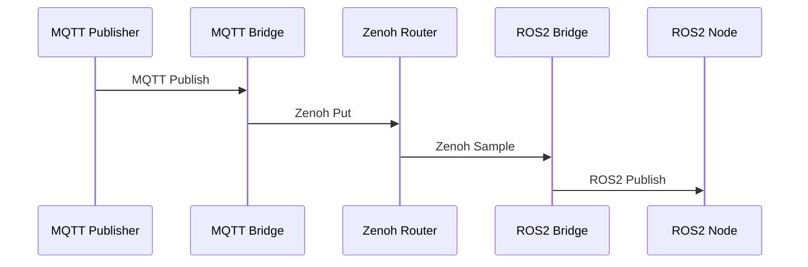

# Data Flow

Understanding how data flows through the Zenoh Multi-Protocol Bridge system.

## Multi-Protocol Flow

Data flows seamlessly between MQTT, Zenoh, and ROS2:

See the [Architecture Overview](overview.md) for more details.
