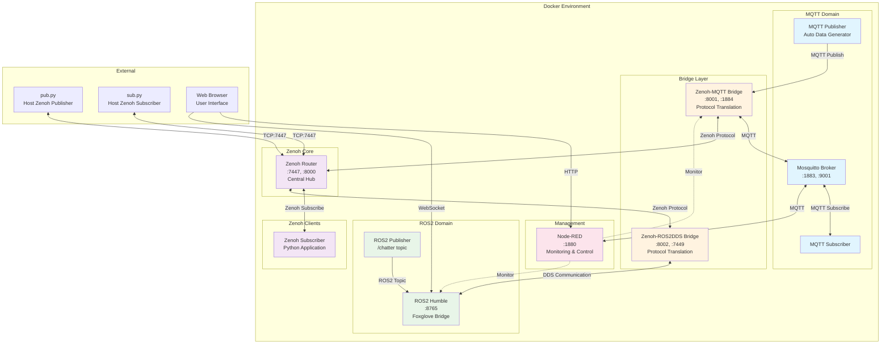
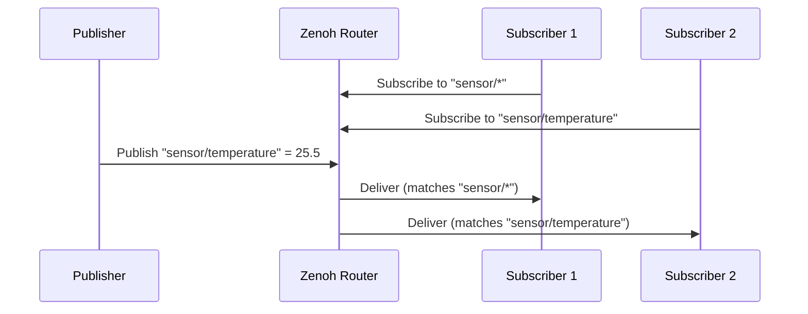
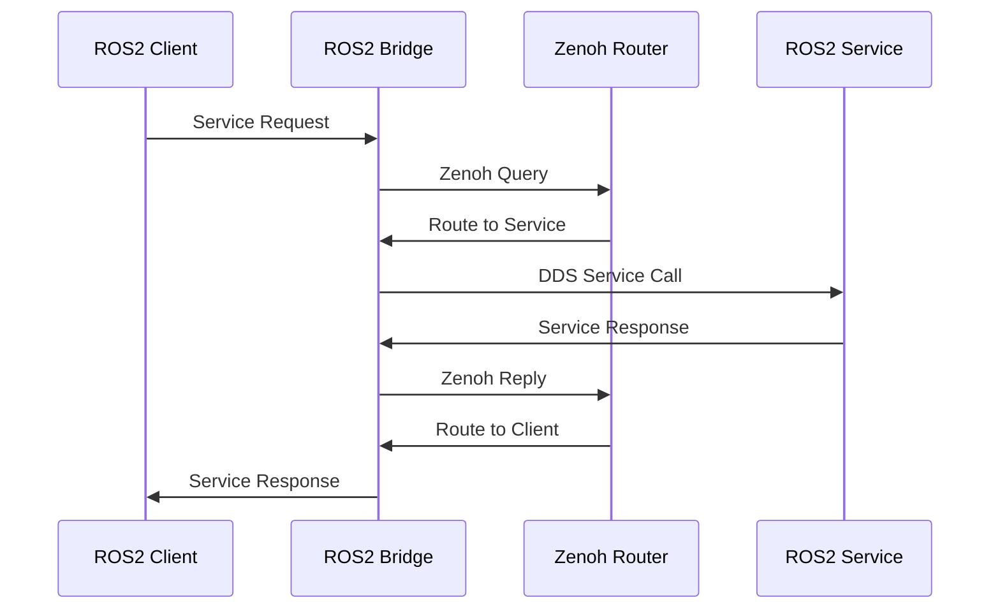

# Architecture Overview

The Zenoh Multi-Protocol Bridge is designed with a microservices architecture, where each component is containerized and communicates over well-defined protocols.

## System Architecture

The system follows a hub-and-spoke architecture with the Zenoh Router at its core, enabling seamless communication between different protocol domains.



## Design Principles

### 1. **Separation of Concerns**

Each component has a single, well-defined responsibility:

- **Protocol Bridges**: Handle translation between protocols
- **Message Brokers**: Manage message routing within their protocol domain
- **Core Router**: Provides the central Zenoh routing infrastructure
- **Clients**: Consume or produce data in specific protocols

### 2. **Scalability**

The architecture supports horizontal scaling:

- Multiple bridge instances can connect to the same Zenoh router
- Clients can be added or removed dynamically
- Load can be distributed across multiple routers

### 3. **Loose Coupling**

Components are loosely coupled through:

- Standardized protocols (MQTT, Zenoh, DDS)
- Configuration-driven topic mapping
- Docker networking for service discovery

### 4. **Protocol Agnostic**

The system abstracts protocol-specific details:

- Applications don't need to know about all protocols
- New protocols can be added with new bridge services
- Protocol translation is transparent to clients

## Key Components

### Core Infrastructure

#### Zenoh Router
- **Role**: Central message routing hub
- **Technology**: Eclipse Zenoh
- **Key Features**:
  - High-performance pub/sub
  - Store/Query capabilities
  - REST API for monitoring
  - Zero-copy architecture

#### Docker Network
- **Name**: `zenoh-mqtt-net`
- **Type**: Bridge network
- **Purpose**: Container-to-container communication
- **DNS**: Automatic service name resolution

### Protocol Domains

#### MQTT Domain
- **Broker**: Eclipse Mosquitto
- **Clients**: Publishers and Subscribers
- **Use Cases**: IoT devices, sensors, legacy systems

#### ROS2 Domain
- **Framework**: ROS2 Humble
- **Middleware**: CycloneDDS
- **Use Cases**: Robotics, autonomous systems

#### Zenoh Domain
- **Router**: Eclipse Zenoh Router
- **Clients**: Python subscribers, external scripts
- **Use Cases**: Edge computing, distributed systems

### Bridge Services

#### Zenoh-MQTT Bridge
- **Function**: Bidirectional MQTT ↔ Zenoh translation
- **Configuration**: JSON5 based
- **Features**:
  - Topic filtering
  - Scope-based key mapping
  - Generalised subscriptions

#### Zenoh-ROS2DDS Bridge
- **Function**: Bidirectional ROS2 ↔ Zenoh translation
- **Configuration**: JSON5 based
- **Features**:
  - Namespace isolation
  - Topic/service/action bridging
  - Selective filtering

### Management & Monitoring

#### Node-RED
- **Purpose**: Visual programming and monitoring
- **Capabilities**:
  - Flow-based programming
  - Real-time dashboards
  - Protocol integration
  - Rule-based automation

## Communication Patterns

### Pub/Sub Pattern

The system primarily uses publish-subscribe pattern:



### Request/Response Pattern

ROS2 services use request/response:



## Data Flow Layers

### Layer 1: Data Generation
- MQTT publishers generate sensor data
- ROS2 nodes publish robot data
- External scripts publish test data

### Layer 2: Protocol Translation
- MQTT Bridge translates MQTT ↔ Zenoh
- ROS2 Bridge translates DDS ↔ Zenoh
- Bidirectional data flow

### Layer 3: Routing
- Zenoh Router distributes messages
- Pattern-based subscription matching
- Efficient message delivery

### Layer 4: Data Consumption
- MQTT subscribers receive IoT data
- ROS2 nodes receive robot commands
- Zenoh subscribers get unified data stream
- Node-RED visualizes and processes data

## Configuration Management

### Static Configuration
- Docker Compose orchestration
- Service configurations (JSON5 files)
- Network and volume definitions

### Dynamic Configuration
- Runtime topic subscriptions
- Flow modifications in Node-RED
- Adjustable publish rates

## Security Considerations

### Network Isolation
- Services communicate within Docker network
- Port mapping controls external access
- Host access restricted to necessary ports

### Access Control
- Mosquitto ACL configuration
- Topic filtering in bridges
- Namespace isolation in ROS2

### Future Enhancements
- TLS/SSL for encrypted communication
- Authentication tokens
- Fine-grained access policies

## Deployment Architecture

### Single-Host Deployment (Current)
```
┌─────────────────────────────────────┐
│         Docker Host                 │
│  ┌───────────────────────────────┐  │
│  │   zenoh-mqtt-net (bridge)     │  │
│  │  ┌──────┐  ┌──────┐  ┌──────┐│  │
│  │  │MQTT  │  │Zenoh │  │ROS2  ││  │
│  │  │Domain│  │Core  │  │Domain││  │
│  │  └──────┘  └──────┘  └──────┘│  │
│  └───────────────────────────────┘  │
└─────────────────────────────────────┘
```

### Multi-Host Deployment (Future)
```
┌──────────────┐      ┌──────────────┐      ┌──────────────┐
│   Host 1     │      │   Host 2     │      │   Host 3     │
│ ┌──────────┐ │      │ ┌──────────┐ │      │ ┌──────────┐ │
│ │MQTT      │ │◄────►│ │Zenoh     │ │◄────►│ │ROS2      │ │
│ │Domain    │ │      │ │Router    │ │      │ │Domain    │ │
│ └──────────┘ │      │ └──────────┘ │      │ └──────────┘ │
└──────────────┘      └──────────────┘      └──────────────┘
```

## Performance Characteristics

### Latency
- **MQTT → Zenoh**: < 10ms (typical)
- **ROS2 → Zenoh**: < 5ms (typical)
- **End-to-End**: < 20ms (MQTT → Zenoh → ROS2)

### Throughput
- **MQTT Bridge**: 10K+ messages/second
- **Zenoh Router**: 1M+ messages/second
- **ROS2 Bridge**: 50K+ messages/second

### Resource Usage
- **Memory**: ~500MB total (all services)
- **CPU**: < 5% idle, < 30% under load
- **Network**: Minimal latency, high efficiency

## Next Steps

- [System Components](components.md) - Detailed component descriptions
- [Data Flow](data-flow.md) - Message flow patterns
- [Network Architecture](network.md) - Network topology and configuration
