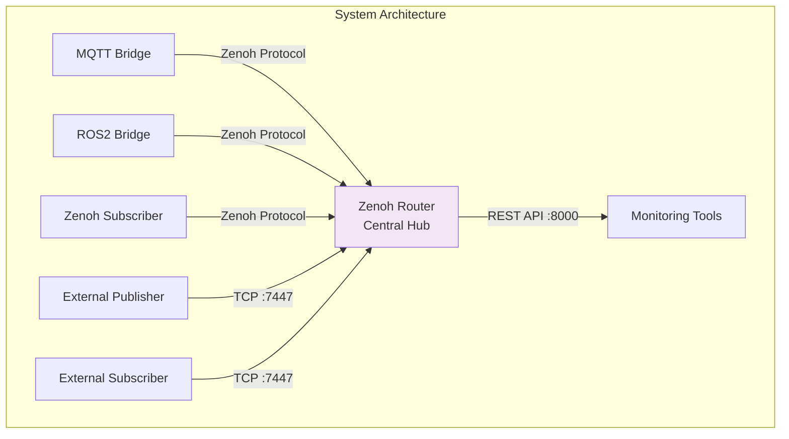

# Zenoh Router

The Zenoh Router is the central component of the Zenoh Multi-Protocol Bridge system, providing high-performance message routing and distribution across the network.

## Overview

The Zenoh Router acts as the backbone of the system, connecting all protocol bridges and clients. It implements the Zenoh protocol, which is designed for:

- **Zero-overhead networking**: Minimal latency and CPU usage
- **Pub/Sub messaging**: Topic-based message distribution
- **Store/Query operations**: Optional data storage and retrieval
- **Multi-protocol support**: REST, TCP, UDP, and WebSocket

## Architecture Role



## Key Features

### 1. Message Routing

The router efficiently routes messages based on:

- **Topic patterns**: Wildcard-based matching (`sensor/*`, `robot/+/status`)
- **Key expressions**: Flexible path-like identifiers
- **Subscriptions**: Dynamic subscription management

### 2. REST API

The router exposes a REST API on port 8000 for:

- Monitoring router status
- Querying stored data
- Publishing messages via HTTP
- Managing subscriptions

### 3. Multiple Transports

Supports various transport protocols:

- **TCP**: Default transport (port 7447)
- **UDP**: For discovery and multicast
- **WebSocket**: For browser-based clients
- **REST**: For HTTP-based interaction

### 4. Store/Query

Optional storage backend for:

- Historical data retrieval
- Query operations
- Data persistence

## Configuration

### Docker Compose Configuration

```yaml
zenoh-router:
  container_name: zenoh-router
  image: eclipse/zenoh:latest
  restart: unless-stopped
  ports:
    - "7447:7447"  # Zenoh TCP
    - "8000:8000"  # REST API
  environment:
    - RUST_LOG=debug
  networks:
    - zenoh-mqtt-net
  command: |
    --listen tcp/0.0.0.0:7447 --rest-http-port 8000
```

### Command-Line Options

The router is started with:

```bash
zenoh --listen tcp/0.0.0.0:7447 --rest-http-port 8000
```

Options explained:

- `--listen tcp/0.0.0.0:7447`: Listen for TCP connections on port 7447
- `--rest-http-port 8000`: Enable REST API on port 8000

### Environment Variables

- `RUST_LOG=debug`: Enable debug logging for troubleshooting

## Ports and Endpoints

| Port | Protocol | Purpose | Access |
|------|----------|---------|--------|
| 7447 | TCP | Zenoh protocol communication | All services |
| 8000 | HTTP | REST API | External access |

## REST API Usage

### Get Router Status

```bash
curl http://localhost:8000/@/router/local
```

### Publish a Message

```bash
curl -X PUT http://localhost:8000/demo/sensor/temp \
  -H 'Content-Type: application/json' \
  -d '{"temperature": 25.5}'
```

### Query Data

```bash
curl http://localhost:8000/demo/sensor/*
```

### Subscribe via REST (SSE)

```bash
curl http://localhost:8000/demo/sensor/* \
  -H 'Accept: text/event-stream'
```

## Integration with Other Components

### MQTT Bridge Connection

The MQTT bridge connects to the router:

```json5
{
  mode: "client",
  connect: {
    endpoints: ["tcp/zenoh-router:7447"]
  }
}
```

### ROS2 Bridge Connection

The ROS2 bridge connects similarly:

```json5
{
  mode: "client",
  connect: {
    endpoints: ["tcp/zenoh-router:7447"]
  }
}
```

### External Clients

Python clients connect from the host:

```python
import zenoh

session = zenoh.open(zenoh.Config())
# Automatically discovers router on localhost:7447
```

## Monitoring and Logging

### View Logs

```bash
# Real-time logs
docker-compose logs -f zenoh-router

# Search for specific messages
docker-compose logs zenoh-router | grep -i "error\|warn"
```

### Log Levels

Configure log level via `RUST_LOG`:

- `error`: Only errors
- `warn`: Warnings and errors
- `info`: General information
- `debug`: Detailed debugging
- `trace`: Very verbose tracing

### Health Check

Check if the router is running:

```bash
# Check container status
docker ps | grep zenoh-router

# Test REST API
curl http://localhost:8000/@/router/local

# Test TCP connection
nc -zv localhost 7447
```

## Performance Considerations

### Message Throughput

The Zenoh router can handle:

- **1M+ messages/second** on modern hardware
- **Sub-millisecond latency** for local routing
- **Thousands of concurrent subscriptions**

### Resource Usage

Typical resource consumption:

- **Memory**: 50-100 MB base, scales with data
- **CPU**: < 2% idle, scales with message rate
- **Network**: Efficient zero-copy operations

### Optimization Tips

1. **Use TCP for high throughput**: More efficient than REST
2. **Enable batching**: Combine multiple small messages
3. **Tune buffer sizes**: Adjust for your workload
4. **Monitor metrics**: Use REST API to track performance

## Troubleshooting

### Router Not Starting

**Symptom**: Container exits immediately

**Solution**:
```bash
# Check logs
docker-compose logs zenoh-router

# Verify port availability
netstat -tuln | grep 7447
netstat -tuln | grep 8000

# Restart with different ports if needed
```

### Clients Can't Connect

**Symptom**: Bridges or clients fail to connect

**Solution**:
```bash
# Verify router is running
docker ps | grep zenoh-router

# Check network connectivity
docker exec zenoh-mqtt-bridge ping -c 2 zenoh-router

# Test TCP port
docker exec zenoh-mqtt-bridge nc -zv zenoh-router 7447
```

### High Memory Usage

**Symptom**: Router consuming excessive memory

**Solution**:
```bash
# Check statistics via REST API
curl http://localhost:8000/@/router/local

# Restart router to clear cache
docker-compose restart zenoh-router

# Consider configuring storage limits
```

## Advanced Configuration

### Custom Configuration File

For advanced scenarios, create a Zenoh configuration file:

```json5
{
  mode: "router",
  
  listen: {
    endpoints: ["tcp/0.0.0.0:7447"]
  },
  
  plugins: {
    rest: {
      http_port: 8000
    },
    storage_manager: {
      volumes: {
        memory: {
          key_expr: "demo/**",
          volume_cfg: {
            backend: "memory",
            max_memory_mb: 256
          }
        }
      }
    }
  }
}
```

Use it with:

```yaml
zenoh-router:
  volumes:
    - ./zenoh/router-config.json5:/etc/zenoh/config.json5
  command: "-c /etc/zenoh/config.json5"
```

### Mesh Network Setup

Connect multiple routers:

```json5
{
  mode: "router",
  
  connect: {
    endpoints: ["tcp/router2:7447", "tcp/router3:7447"]
  }
}
```

## Security

### Network Security

- Runs in isolated Docker network
- Only exposed ports accessible from host
- Consider TLS for production deployments

### Access Control

- REST API has no authentication by default
- Consider using reverse proxy with auth
- Implement network-level security

## Best Practices

1. **Monitoring**: Regularly check REST API for health
2. **Logging**: Keep debug logs during development
3. **Updates**: Keep router image updated
4. **Backup**: Store configuration files in version control
5. **Testing**: Test router under load before production

## See Also

- [Zenoh-MQTT Bridge](zenoh-mqtt-bridge.md)
- [Zenoh-ROS2DDS Bridge](zenoh-ros2dds-bridge.md)
- [Architecture Overview](../architecture/overview.md)
- [Official Zenoh Documentation](https://zenoh.io/docs/)
