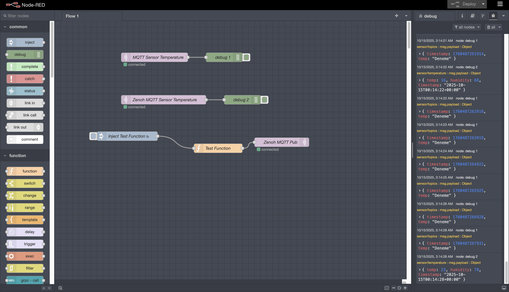
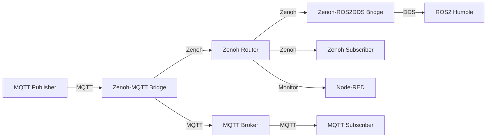

# Zenoh Multi-Protocol Bridge

<div align="center">



**A comprehensive multi-protocol bridge system connecting Zenoh, MQTT, and ROS2**

[](LICENSE)
[](https://www.docker.com/)
[](https://docs.ros.org/en/humble/)

</div>

## 🎯 Overview

The Zenoh Multi-Protocol Bridge Project is a comprehensive solution designed to enable seamless data transfer between different communication protocols commonly used in IoT, robotics, and distributed systems. This project bridges **Zenoh**, **MQTT**, and **ROS2** protocols, allowing them to work together in modern IoT and robotics ecosystems.

## ✨ Key Features

- **🔄 Multi-Protocol Translation**: Seamless data transfer between MQTT, Zenoh, and ROS2 protocols
- **⚡ Real-Time Communication**: Instant processing of sensor and robotics data
- **📈 Scalable Architecture**: Docker-based microservices structure
- **📊 Monitoring and Control**: Visual flow control with Node-RED
- **🤖 Robotics Integration**: ROS2 DDS bridge for robotics applications
- **🧪 Testing Environment**: Comprehensive testable system with multiple protocol support

## 🎯 Project Objectives

This project serves multiple purposes in modern distributed systems:

1. **Multi-Protocol Translation**: Enable data transfer between MQTT, Zenoh, and ROS2 protocols
2. **Real-Time Communication**: Provide instant processing of sensor and robotics data
3. **Scalable Architecture**: Offer a Docker-based microservices structure
4. **Monitoring and Control**: Include visual flow control with Node-RED
5. **Robotics Integration**: Support ROS2 DDS bridge for robotics applications
6. **Testing Environment**: Provide a comprehensive testable system with multiple protocol support

## 🚀 Quick Start

Get started with the Zenoh Multi-Protocol Bridge in just a few steps:

```bash
# Clone the repository
git clone https://github.com/harunkurtdev/zenoh-multi-bridge.git
cd zenoh-multi-bridge

# Start all services
docker-compose up -d

# Follow logs for all services
docker-compose logs -f
```

Visit the web interfaces:

- **Node-RED Dashboard**: [http://localhost:1880](http://localhost:1880)
- **Zenoh REST API**: [http://localhost:8000](http://localhost:8000)
- **MQTT Bridge API**: [http://localhost:8001](http://localhost:8001)
- **ROS2 Bridge API**: [http://localhost:8002](http://localhost:8002)
- **Foxglove Studio**: [http://localhost:8765](http://localhost:8765)

## 📋 System Components

The system consists of several interconnected components:

| Component | Description | Port(s) |
|-----------|-------------|---------|
| **Zenoh Router** | Central router for Zenoh network | 7447, 8000 |
| **MQTT Broker** | Eclipse Mosquitto message broker | 1883, 9001 |
| **Zenoh-MQTT Bridge** | Protocol bridge between MQTT and Zenoh | 8001, 1884 |
| **ROS2 Humble** | ROS2 robotics framework | 8765 |
| **Zenoh-ROS2DDS Bridge** | Protocol bridge between ROS2 DDS and Zenoh | 8002, 7449 |
| **Node-RED** | Visual flow editor and automation | 1880 |

## 🔄 Data Flow



## 🎯 Use Cases

### IoT-Robotics Integration
Connect sensor data from IoT devices (MQTT) to robot control systems (ROS2) for real-time environmental data processing in autonomous robots.

### Hybrid Communication Systems
Integrate legacy MQTT infrastructure with modern Zenoh protocol adoption and ROS2 robotics ecosystem connectivity.

### Research and Development
Provide a multi-protocol testing environment for performance comparison and development sandbox for distributed systems.

### Industrial Automation
Enable communication between SCADA systems (MQTT) and robot controllers (ROS2) with real-time monitoring capabilities.

### Smart City Applications
Facilitate communication between IoT sensors and autonomous vehicles for traffic management and environmental monitoring.

## 📚 Documentation Structure

- **[Getting Started](getting-started/installation.md)**: Installation, prerequisites, and quick start guides
- **[Architecture](architecture/overview.md)**: System architecture, components, and data flow
- **[Components](components/zenoh-router.md)**: Detailed documentation for each system component
- **[Configuration](configuration/overview.md)**: Configuration guides for bridges and services
- **[Usage](usage/testing.md)**: Testing procedures and monitoring guides
- **[Use Cases](use-cases/iot-robotics.md)**: Real-world application examples
- **[API Reference](api/endpoints.md)**: REST API endpoints and documentation

## 🤝 Contributing

Contributions are welcome! Please feel free to submit a Pull Request. For major changes, please open an issue first to discuss what you would like to change.

## 📄 License

This project is licensed under the Apache License 2.0 - see the LICENSE file for details.

## 🙏 Acknowledgments

- [Eclipse Zenoh](https://zenoh.io/) - Zero Overhead Pub/Sub, Store/Query and Compute
- [Eclipse Mosquitto](https://mosquitto.org/) - An open source MQTT broker
- [ROS2](https://docs.ros.org/) - Robot Operating System 2
- [Node-RED](https://nodered.org/) - Low-code programming for event-driven applications

## 📞 Support

For questions and support, please open an issue on the [GitHub repository](https://github.com/harunkurtdev/zenoh-multi-bridge/issues).
